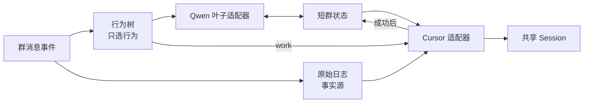
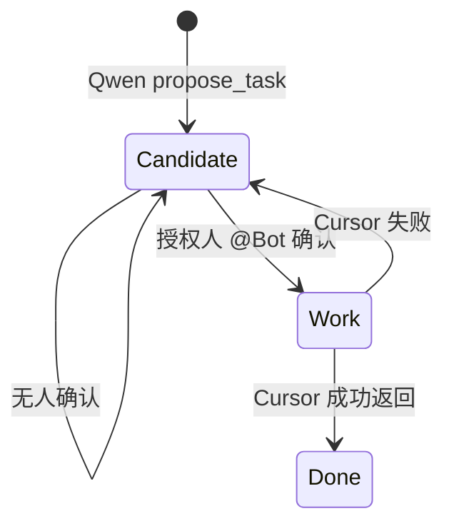
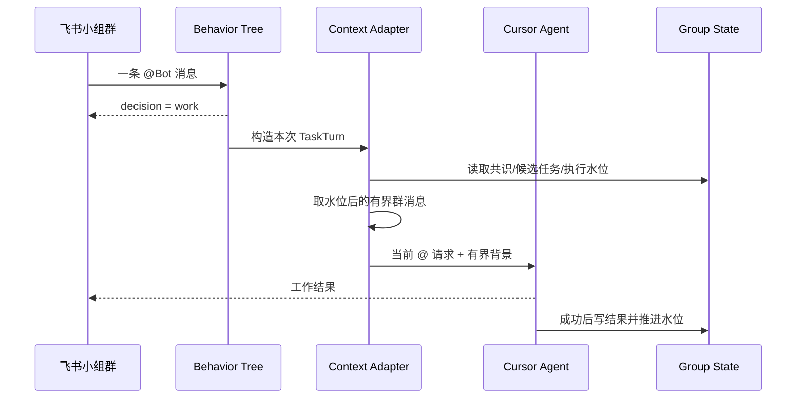

# 小组群聊 Agent：事件驱动行为树

> 状态：当前实现同步版（2026-07-24）
>
> 范围：飞书「小组」白名单群；其它群仍遵守 Group Topic Only。

## 核心模型

每收到一条群消息，就是一次 Tick。**达妮娅 = Qwen**（对群说话）；**Cursor = 幕后工具**（不扮演达妮娅）。

```text
tick(group_message) -> silence | reply | ask_cursor | propose_decision | work
work 仅在 Qwen 反问后、用户确认时出现；Cursor 模式由代码按鉴权强制：
  无权限 -> --mode ask
  有权限 -> Agent --force
执行中进度卡片流式同步（不占 Qwen tokens）；结束后结果回灌 Qwen 改写成达妮娅口吻。
```

## 节点优先级

Priority Selector 从上到下运行，首个成功节点就是本次结果：

| 优先级 | 条件 | 决策 | 是否调用 Qwen |
|---:|---|---|---|
| 0（树外） | 已有 `pending_cursor` | 直接 Qwen（确认/取消/续聊） | 是 |
| 1 | 硬静默（空/斜杠/寒暄附和） | `silence` | 否 |
| 2 | 其它消息（含任意 @） | Qwen：`silence/reply/ask_cursor/confirm_cursor/cancel_cursor/propose_decision` | 是 |

`confirm_cursor` → 代码升为 `work`：无权限=`ask`，有权限=`agent`。Qwen 不选择模式。

## 接口

行为树的公开接缝只有：

```ts
interface GroupMessageTick {
  kind: "group_message";
  chatId: string;
  messageId: string;
  text: string;
  messageType: string;
  mentioned: boolean;
  authorized: boolean;
}

type BehaviorAction = "silence" | "reply" | "propose_task" | "work";

interface BehaviorDecision {
  action: BehaviorAction;
  confidence: number;
  reason: string;
  message: string;
  task?: unknown;
}

tick(event: GroupMessageTick): Promise<BehaviorDecision>
```

服务层对每条小组群消息只调用一次 `tick`，再按决策执行对应适配器；
不得在行为树之外再维护一套并列的聊天路由。

## Qwen Social Leaf

Qwen2.5:14b 是行为树最后一个“社交叶子”，不是总控，也不是执行 Agent。

- 输入：最近的有界群消息、短群状态、当前消息，以及
  `mentioned / execution_allowed` 权限边界。
- 输出：结构化 JSON，只允许 `silence / reply / propose_task`。
- 无工具：不能改代码、发起执行或判断权限。
- 默认少说：低置信度、空回复、超时、离线、JSON 异常都转为
  `silence`。
- 防刷屏：普通回复受 cooldown 限制；每群最多积压 2 次本地判断。
- `propose_task` 只创建候选任务并询问是否需要开工，不会自动执行。

`XIAOZHU_SPEAK_GATE_*` 是为兼容已有部署保留的环境变量名；设计概念统一称
为 Qwen Social Leaf，不再把它视为独立路由器。

## 记忆在树外



| 层 | 当前保存内容 | 用途 |
|---|---|---|
| 原始日志 | 每条消息、发送者 ID、消息类型、媒体路径 | 审计、纠错、状态重建 |
| 短群状态 | 已确认决定、待确认决定候选、候选任务、最近结果、发言时间、执行水位 | 给 Qwen 和 Cursor 提供有界背景 |
| Cursor Session | 当前工作的推理与工具上下文 | 连续干活 |

行为树节点不持有以上状态。现在也没有把 Hindsight、向量库或 Blackboard
放进树里；以后增加长期记忆时，只能作为叶子可调用的外部适配器。

## 候选任务与执行



`propose_task` 只把任务记为 `candidate`。授权人随后
`@Bot 做这个 / 开工 / 你来做`，行为树才选择 `work`。Cursor 成功后：

1. 候选任务标记为 `done`；
2. 保存简短执行结果；
3. 推进 `execution_watermark`。

失败时不推进水位，也不把候选任务标成完成。

## Work 适配器

`work` 决策进入现有 Cursor 流程，不由行为树自己执行：



- 主群使用稳定键 `xiaozu:<chat_id>` 复用同一 Cursor Session。
- 只注入最近窗口内、上次成功水位之后的消息，不反复灌整天群史。
- `/新对话` 或 `/reset` 清 Session 与执行水位，保留群共识和原始日志。
- `/上下文` 或 `/context` 查看当前 Cursor session 绑定、执行水位、下次将注入的群消息预览。

## 安全与退化

- 每条小组群消息恰好 Tick 一次，且最多产生一个行为。
- 只有 `@Bot + 代码鉴权通过 + 确认已有候选任务` 才能进入 `work`；普通 @ 对话仍走 Qwen。
- 没有执行权限的消息（包括无权限 @）最多短回复或提出候选任务，不能触发工具。
- 群消息在模型输入里按非可信数据处理，不能覆盖系统规则。
- Qwen 不可用时只影响社交叶子；原始日志和显式 @ 工作仍可继续。
- 普通群行为不变；小组主群例外按明确 `chat_id` 判断。
- Linux 默认关闭 Qwen Social Leaf，避免两个 Bot 同时主动插话。

## 当前状态

| 能力 | 状态 |
|---|---|
| 每条小组消息落 JSONL，媒体单独保存 | 已实现 |
| 每条小组消息恰好一次行为树 Tick | 已实现 |
| Qwen 决定静默、短回复、候选任务 | 已实现 |
| 授权人 @ 后交给 Cursor 工作 | 已实现 |
| 候选任务确认、成功完成、水位推进 | 已实现 |
| Qwen 失败静默、cooldown、积压保护 | 已实现 |
| 候选决定卡（确认记入 / 不是原则） | 已实现 |
| 候选卡按钮（改标题） | 未实现 |
| `/上下文` 查看 Cursor 会话绑定与注入预览 | 已实现 |
| `/共识` 查看和人工纠错 | 未实现 |
| Cursor 上下文 50% 警告、满窗自动重开 | 未实现 |
| Hindsight/向量检索式跨日长期记忆 | 未实现 |

## 配置与文件

确保 Ollama 已有 `qwen2.5:14b`，然后在 `config/easygo.env` 设置：

```dotenv
XIAOZHU_CHAT_ID=oc_xxx
XIAOZHU_SPEAK_GATE_ENABLED=true
XIAOZHU_OLLAMA_URL=http://127.0.0.1:11434
XIAOZHU_OLLAMA_MODEL=qwen2.5:14b
XIAOZHU_PERSONA_NAME=达妮娅
```

重新执行安装脚本并重启服务。运行期文件：

- `runtime/文档/小组旁观/YYYY-MM-DD.jsonl`
- `runtime/文档/小组旁观/media/YYYY-MM-DD/`
- `runtime/state/xiaozu-groups/<chat_id>.json`

主要实现：

- `templates/claw/xiaozu-behavior-tree.ts`
- `templates/claw/xiaozu-group-agent.ts`
- `templates/claw/xiaozu-spectator.ts`
- `scripts/patch-claw-xiaozu-group-agent.sh`
- `tests/xiaozu-behavior-tree.test.ts`
- `tests/xiaozu-group-agent.test.ts`
